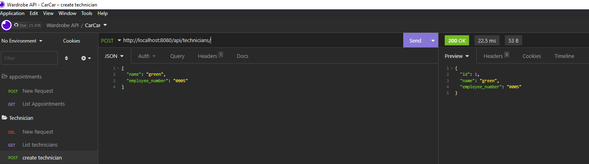

# CarCar

Team:

* Alissa Ramos - Service
* Mack Hill - Sales

## How to Run this Application:
You can get started with CarCar immediately by using a local development enviornment.

## Development Enviornment(Local)
System requirments
- Docker
- Git

## Getting started with Local Development
Follow these simple instructions to setup a local development enviornment

1. Fork this repository at https://gitlab.com/hillmack92/project-beta
2. Select clone with HTTPS, and copy the link
3. Clone the repo using your terminal
$ git clone https://gitlab.com/hillmack92/project-beta.git
4. Change your working directory to the new cloned repo:
$cd project-beta
5. Spin up all required infrastructure using Docker Compose:
In your terminal run the following commands:
- docker volume create beta-data
- docker-compose build
- docker-compose up
6. When you run docker-compose up and if you're on macOS, you will see a warning about an environment variable named OS being missing. You can safely ignore this.
7. Below you can read the project design and each microservices details to understand how everything works.
8. Once all your containers in Docker are up and running go to http://localhost:3000/ to see the web app.
9. At the top of your screen use the navbar to navigate through out the website
10. You will be able to add automobiles in your inventory by creating a manufacturer, vehicle model, and automobile. Once you've done that you can create customers, salesperson, technicians, service appointments. As well as you will be able to search by the ViN for the lost of appointments, or service history.

- You can see the Manufactures, Vehicle Models, and Automobiles in the first few tabs.
In order to add one of them, click the add button on one of these pages which will redirect you to the add pages.
- To add a manufacturer, simply type the manufacturer name and hit create. This should redirect you to the manufacturer list page upon creation.
- For the vehicle model  type the name of the vehicle model, enter a picture URL, and choose a manufacturer from the dropdown. You must add a manufacturer before you can add a vehicle. This should redirect you to the vehicle model list page upon creation.
- To add an automobile,  type the color, the year and the vin number of the automobile. Then choose the model of the automobile from the dropdown. You must add a vehicle model (and also a manufacturer)before you can add an automobile. This should redirect you to the automobile list page upon creation.
- You can also see the employees(sales people), technicians, and customers.
- Lastly, you are able to add a sale, see all sales, a list of sales per employee, and add a service appointment.

## Application Diagram

## Urls and Ports for Microservices
    
    Sales: (http://localhost:8090/)
    
    - port: 8090
    
    Service: (http://localhost:8080/)
    
    - port: 8080
    
    Inventory: (http://localhost:8100/)
    
    - port: 8100
    
    React Website: (http://localhost:3000/)
    
    - port: 3000

## Service API Documentation

Document the endpoints of your API for each of the methods you implement (GET, POST, etc..)
Provide sample success responses and sample request body data for the post requests.

You could theoretically screenshot insomnia.

Service API Documentation
Create a technician:

List Technicians:

List Appointments:

New Appointments:

## Sales API Documentation
- Sales Person
    
    List all sales people: GET: [http://localhost:8090/api/employees/]

    Create new sales person: POST: [http://localhost:8090/api/employees/]
    
    - Layout for JSON body: {"name": "employee","employee_number": "3"}
    
    Update a sales person: PUT: [http://localhost:8090/api/employees/1/]
    
    - Layout for JSON body: {"name": "Bob","employee_number": 2}
    
    Delete a sales person: DELETE: [http://localhost:8090/api/employees/1/]
- Customer
    
    List all customers: GET: [http://localhost:8090/api/customers/]
    
    Create new customer: POST: [http://localhost:8090/api/customers/]
    
    - Layout for JSON body: {"name": "customter3","phone_number": "1234567890","address": "1234 Address St"}
    
    Update customer: PUT: [http://localhost:8090/api/customers/1/]
    
    - Layout for JSON body: {"name": "John","phone_number": "0987654321","address": "1235 Address St"}
    
    Delete a customer: DELETE: [http://localhost:8090/api/customers/1/]
    
- Sales
    
    List all sales: GET: (http://localhost:8090/api/sales/)
    
    Create a sale: POST: (http://localhost:8090/api/sales/)
    
    - Layout for JSON body: {"employee": 3,"customer": 1,"sale_price": 20000,"automobile": "Import Href"}
    
    Update a sale: PUT: (http://localhost:8090/api/sales/1/)
    
    - Layout for JSON body: {"employee": 3,"customer": 1,"sale_price": PRICE,"automobile": Import Href}
    
    Delete a sale: DELETE: (http://localhost:8090/api/sales/1/)

## Value Objects

If you didn't identify the VOs in your diagram, then identify them here.

Inventory Value objects:
Manufacturer
Vehicle Model

Service Value objects:
Technician
Appointment

Sales Value object:
AutomobileVO
Employee
Sale

## Inventory microservice
We first started working on inventory.
Mack worked on making ManufacturersList.js, VehicleModelsList.js, and AutomobilesList.js. Then made sure they were rendering on the React page by including Nav links in Nav.js, and route paths in App.js

Alissa worked on making ManufacturerForm.js, VehicleModelForm.js, and AutomobileForm.js.
Inventory API keeps track of the automobile inventory for the automobile dealership.

- A Manufacturer has:
    - name
    - You can create a Manufacturer via the link "Add Manufacturer" in navbar.
- A Vehicle Model has:
    - name
    - picture_url
    - manufacturer
    - You can create a Vehicle Model via the link "Add Vehicle Models" in navbar.
- An Automobile has:
    - VIN
    - color
    - year
    - model
    - Manufacturer
    - You can create an Automobile via the link "Automobiles" in navbar.
- List of manufacturers:
    - show a list of manufacturers
    - You can access this via the link "Manufacturers" in navbar.
- List of vehicle models:
    - show a list of vehicle models
    - You can access this via the link "Vehicle Models" in navbar.
- List of automobiles:
    - show a list of automobiles in inventory
    - You can access this via the link "Automobiles" in navbar.

Inventory API keeps track of the automobile inventory for the automobile dealership.

- A Manufacturer has:
    - name
    - You can create a Manufacturer via the link "Add Manufacturer" in navbar.
- A Vehicle Model has:
    - name
    - picture_url
    - manufacturer
    - You can create a Vehicle Model via the link "Add Vehicle Models" in navbar.
- An Automobile has:
    - VIN
    - color
    - year
    - model
    - Manufacturer
    - You can create an Automobile via the link "Automobiles" in navbar.
- List of manufacturers:
    - show a list of manufacturers
    - You can access this via the link "Manufacturers" in navbar.
- List of vehicle models:
    - show a list of vehicle models
    - You can access this via the link "Vehicle Models" in navbar.
- List of automobiles:
    - show a list of automobiles in inventory
    - You can access this via the link "Automobiles" in navbar.

## Service microservice
- Alissa
Service Api keeps track of service appointments for automobiles and their owners.
- Alissa
Service Api keeps track of service appointments for automobiles and their owners.

- A technician has:
    - name
    - employee number
    - You can create a Technician via the link  "Enter a Technician" in navbar.
- A service appointment has:
    - VIN of the vehicle
    - name of the person to whom the vehicle belongs "Owner"
    - the date and time of the appointment
    - the assigned technician
    - a reason for the service appointment
    - You can create an appointment via the link "Enter a Sevice Appointment" in navbar.
- List of appointments:
    - show a list of scheduled appointments contain all the details (cancelled - and finished appointment not shown)
    - If the VIN of an automobile was at one time in Inventory, that appointment will be marked for "VIP treatment"
    - Each appointment in the list have a button that allows a service concierge to cancel the appointment, or to show that the service appointment has been finished
    - You can access the list of appointments via the link "List of Appointments" in navbar.
- Service history:
    - show a list of service appointments for a specific VIN
    - You can access this via the link "Service History" in navbar. Then enter a VIN into the search box to show list of service appointments for that VIN.
- A technician has:
    - name
    - employee number
    - You can create a Technician via the link  "Enter a Technician" in navbar.
- A service appointment has:
    - VIN of the vehicle
    - name of the person to whom the vehicle belongs "Owner"
    - the date and time of the appointment
    - the assigned technician
    - a reason for the service appointment
    - You can create an appointment via the link "Enter a Sevice Appointment" in navbar.
- List of appointments:
    - show a list of scheduled appointments contain all the details (cancelled - and finished appointment not shown)
    - If the VIN of an automobile was at one time in Inventory, that appointment will be marked for "VIP treatment"
    - Each appointment in the list have a button that allows a service concierge to cancel the appointment, or to show that the service appointment has been finished
    - You can access the list of appointments via the link "List of Appointments" in navbar.
- Service history:
    - show a list of service appointments for a specific VIN
    - You can access this via the link "Service History" in navbar. Then enter a VIN into the search box to show list of service appointments for that VIN.

## Sales microservice
- Mack
Created AutomobileVO, Employee, Customer, and Sale models.
- Mack
Created AutomobileVO, Employee, Customer, and Sale models.
Sales has foreign keys:
    -automobile pointing to AutomobileVO,
    -employee pointing to Employee
    -employee pointing to Employee
    -customer pointing to Customer

Automobile data is gathered through polling the api database in inventory

Sales microservice keeps track of customers, sales reps, and sales record

- Creation/list of a SalesRep
    - Requires input of name and a unique employeeID to create
    - Get request will send back name and employeeID
    - To access SalesRep information send a get request to 
    "[http://localhost:8090/api/employees/]
- Creation/list of Customers
    - Requires input of name, address, and phone_num (formatting is handled in the frontend)
    - Get request will list an array of objects that contains name, address, phone_num, and customer id
    - To access Customer information send a get request to 
    "[http://localhost:8090/api/customers/]
- List of Sales Record / Creation of Sales Record
    - Requires: An automobile(with associated vin) , customer, sales person to be made before creating a sales record
    - Creation of a sales record requires employeeID (coming from SalesPerson model), customer (customer id from customer model) and vin number(from AutoMobile VO that comes from our poller)
    - A record will send back price, id(of sales record), SalesPerson object model, automobile vin, customer name, and sales person name and employee ID (for ease of use)
    - To access sales record send a get request to 
    "[http://localhost:8090/api/sales]

Sales microservice keeps track of customers, sales reps, and sales record

- Creation/list of a SalesRep
    - Requires input of name and a unique employeeID to create
    - Get request will send back name and employeeID
    - To access SalesRep information send a get request to 
    "[http://localhost:8090/api/employees/]
- Creation/list of Customers
    - Requires input of name, address, and phone_num (formatting is handled in the frontend)
    - Get request will list an array of objects that contains name, address, phone_num, and customer id
    - To access Customer information send a get request to 
    "[http://localhost:8090/api/customers/]
- List of Sales Record / Creation of Sales Record
    - Requires: An automobile(with associated vin) , customer, sales person to be made before creating a sales record
    - Creation of a sales record requires employeeID (coming from SalesPerson model), customer (customer id from customer model) and vin number(from AutoMobile VO that comes from our poller)
    - A record will send back price, id(of sales record), SalesPerson object model, automobile vin, customer name, and sales person name and employee ID (for ease of use)
    - To access sales record send a get request to 
    "[http://localhost:8090/api/sales]